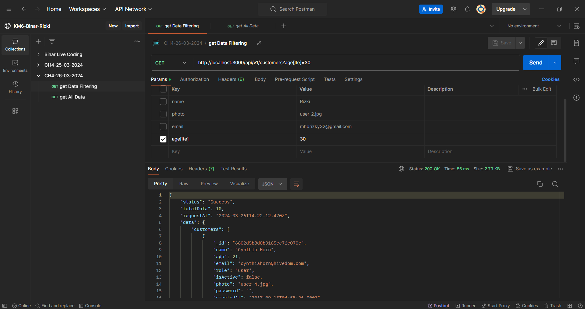
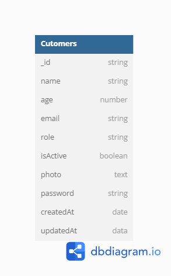

<h1 align="center">
  <br>
  
  <br>
  <br>
  Binar Live Coding Chapter 4 Using Express
  <br>
</h1>

<h4 align="center">A Simple Binar Live Coding API Project For Customer Using <a href="https://expressjs.com/" target="_blank">express.js</a>.</h4>

<p align="center">
  <a href="#key-features">express</a> •
  <a href="#how-to-use">postman</a> •
  <a href="#download">mongodb</a> •
  <a href="#credits">javascript</a> •
  <a href="#related">nodejs</a> •
  <a href="#license">json</a>
</p>



## Data Diri

### KM x Binar Academy Batch 6

|                |                      |
| -------------- | -------------------- |
| Nama Peserta   | Muhammad Rizki       |
| Kelas          | FSW 1                |
| Fasilitator    | Imam Taufiq Hermawan |
| ID Fasilitator | F-FSW24001086        |
|                |                      |

## Table Diagram



## Feature

### 1. Import Data Customer Seeder

```
npm start import-data
```

### 2. Clear Data Customer

```
npm start clear-data
```

# CH4-25-03-2024-Express-Mongoose-V2
